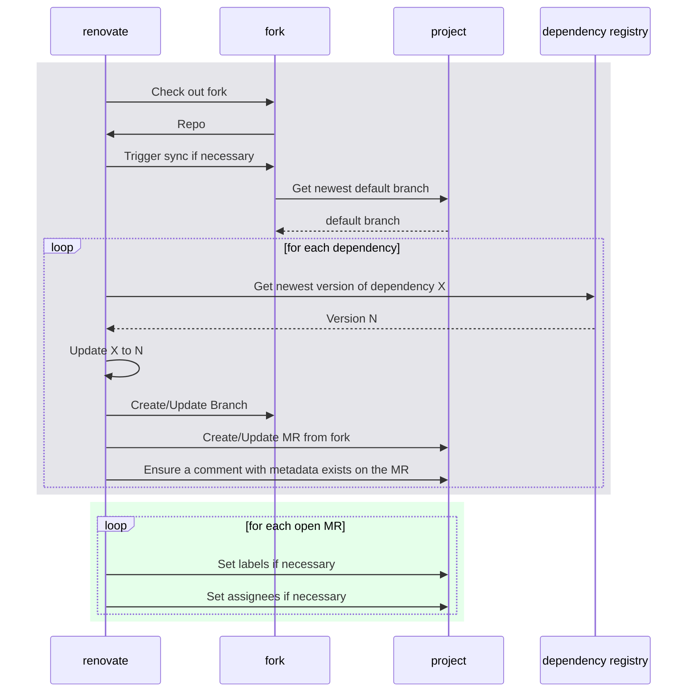

# renovate-gitlab-bot

> Currently open MRs can be [found here](https://gitlab.com/dashboard/merge_requests?scope=all&utf8=%E2%9C%93&state=opened&author_username=gitlab-renovate-bot)

The bot uses [renovatebot](https://github.com/renovatebot/renovate) to
automatically create MRs for updating dependencies.

The following repositories are currently being updated automatically.
For more info on how to add a project, see the section on [setting up a new project](#setting-up-a-new-project)

<!-- rep -->

- [gitlab-renovate-forks/gitlab-ui](https://gitlab.com/gitlab-renovate-forks/gitlab-ui)
- [gitlab-renovate-forks/gitlab](https://gitlab.com/gitlab-renovate-forks/gitlab)
- [gitlab-renovate-forks/teampage-map](https://gitlab.com/gitlab-renovate-forks/teampage-map)

<!-- rep -->

## Process

This repo consists of three main components:

1. A [config file](./config.js) with definitions on how to update which dependency.
   See https://docs.renovatebot.com/configuration-options/ for reference
2. A post-processing script which runs on created MRs.
3. The build of a docker image containing renovate and aforementioned config.
   It is running on a [tight schedule](https://gitlab.com/gitlab-org/frontend/renovate-gitlab-bot/-/pipeline_schedules).

The main workflow consists of two parts:

1. An unprivileged account [@gitlab-renovate-bot](https://gitlab.com/gitlab-renovate-bot)
   runs renovate against a fork of the target project.

   We are using forks of projects in order to avoid security issues where a malicious dependency
   could upload secrets during our CI pipelines.

   This is supposed to mimic community contributions and reviewers / maintainers should proceed
   with similar caution to these updates in order to prevent supply chain attacks.

2. A privileged account [@gitlab-bot](https://gitlab.com/gitlab-bot) will try to assign assignees
   and labels based on the definitions from the config.

A general overview of this process is shown in the sequence diagram below.

The first box describes the renovate flow on a high level, as renovate is a complex piece of software
which can handle a lot of states an MR can be in. This is the _unprivileged_ part of the workflow.

The second box describes what the _privileged_ part of the workflow looks like.

## Setting up a new project

1.  Open a private tab or different browser and log in with the
    [@gitlab-renovate-bot](https://gitlab.com/gitlab-renovate-bot) credentials from 1Password.
2.  Locate the project you want to renovate and fork it into the [gitlab-renovate-forks]
3.  Go into the project settings and set up mirroring (Settings -> Repository).

    1. You need to enter the upstream repo
    2. Enable "overwrite diverged branches" (should never happen, but upstream should be the single source of truth)
    3. Enable "only protected branches" which probably helps with performance

    

4.  Create an MR which adds your fork to [the config](./config.js).

[gitlab-renovate-forks]: https://gitlab.com/gitlab-renovate-forks
