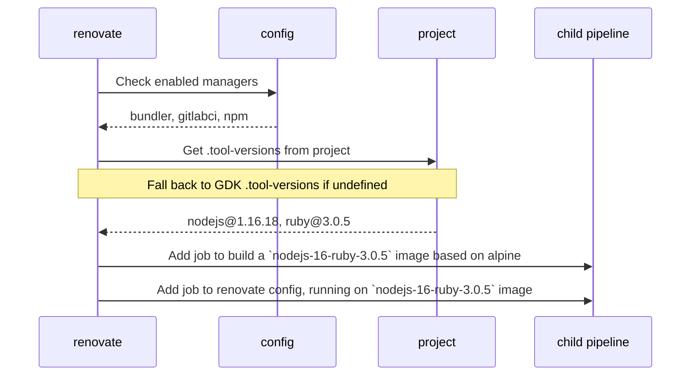

# CI Build Matrix

Over time we have onboarded a lot more projects to the renovate bot.
Different projects might have different requirements when it comes to renovating them.

Sometimes we ran into problems, if a project needed e.g. a newer NodeJS or a newer GoLang version than
what the renovate docker image provided. This is mainly due to the fact, that renovate sometimes calls native `gem`, `yarn` or whatever dependency management tool is in use.

We have solved this problem with [Dynamic Child Pipelines](https://docs.gitlab.com/ee/ci/pipelines/downstream_pipelines.html#dynamic-child-pipelines).

There is a [script](../scripts/orchestrate-child-pipeline.mjs):

1. which analyses each renovate config
2. determine which tools are needed by a renovated project
3. create a job to build the necessary image (if necessary)
4. create a job for each renovate config file

The plan is to make this orchestration a little smarter, by:

1. Only creating build jobs if necessary (e.g. image doesn't exist yet)
2. In MRs: Only create renovate jobs if config of said jobs has been touched
