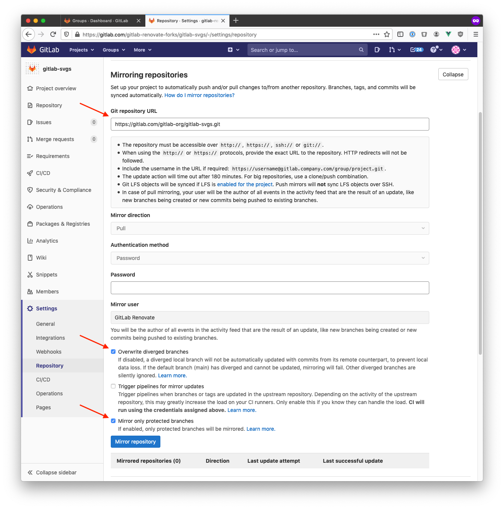

# Setting up a new project

1.  Open a private tab or different browser and log in with the
    [@gitlab-renovate-bot](https://gitlab.com/gitlab-renovate-bot) credentials from 1Password.
2.  Locate the project you want to renovate and fork it into the [gitlab-renovate-forks]
3.  Go into the project settings and set up mirroring (Settings -> Repository).

    1. You need to enter the upstream repo
    2. Enable "overwrite diverged branches" (should never happen, but upstream should be the single source of truth)
    3. Enable "only protected branches" which probably helps with performance

    

4.  Create an MR which adds your fork to [the config](./config.js).

[gitlab-renovate-forks]: https://gitlab.com/gitlab-renovate-forks
